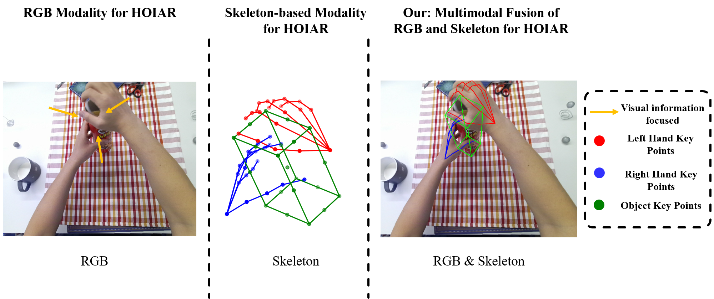

## Overview
+ We address the challenging problem of hand–object interaction action recognition by jointly modeling hand pose and object information, moving beyond conventional skeleton-only or RGB-only approaches. This joint formulation allows the model to better capture the semantic context of interactions.
+  We propose a novel framework, HOINet, which integrates skeleton sequences and RGB visual features for joint modeling of hand–object interactions. Within HOINet, the  STSABlock is designed to enhance spatio-temporal reasoning on hand motion, while the MFModule explicitly fuses hand action and object tokens to capture cross-modal dependencies.  



## <font style="color:rgb(31, 35, 40);">Environment Installation</font>
1. <font style="color:rgb(31, 35, 40);">Clone the Current Repo</font>

```shell
git clone https://github.com/lneverd/HOINet.git
```

2. <font style="color:rgb(31, 35, 40);">Setup the conda environment</font>

```shell
conda create --name hoinet python=3.8
conda activate hoinet
# install the pytorch version compatible with the your cuda version
pip install -r requirements.txt
```

## <font style="color:rgb(31, 35, 40);">Dataset Setup</font>
+ H2O Dataset

You can download the dataset via the following [link](https://github.com/taeinkwon/h2odataset). Note: The official release includes three formats: all ego pose. This method utilizes the ego format.Then, run the Python script in the `data/h2o/generate_h2o.py` directory to generate the training data. 

+ FPHA Dataset

You can download the fpha dataset via this [link](https://github.com/guiggh/hand_pose_action) and use the `data/fpha/generate_fpha.py` script to generate training data.

## Trainning
The configuration files for this method are stored in the `config/` directory. Each dataset corresponds to a distinct training configuration file. Through these YAML configuration files, you can modify the model's hyperparameters, data preprocessing steps, and working directory paths.In training mode, you need to change the `run_mode` setting in the corresponding YAML configuration file to `train`.Training is then performed using the following Python script:

```python
python main_h2o.py #H2O Dataset
python main_fpha.py #FPHA Dataset
```

## Evaluation
In training mode, you need to change the `run_mode` setting in the corresponding YAML configuration file to `train`.